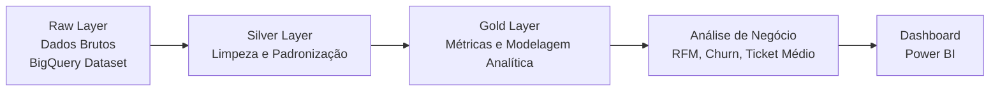
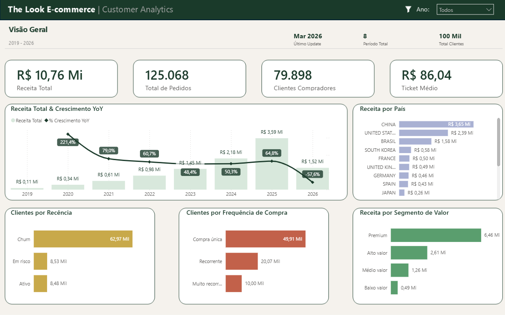

# 📊 The Look E-commerce — Data Analytics Case

Projeto de análise de dados utilizando **SQL (Google BigQuery)** e **Power BI**, com o objetivo de estruturar dados de um e-commerce e gerar insights sobre comportamento de clientes e desempenho de vendas.

---

# 🎯 Objetivo

Construir uma **Single Source of Truth (SSOT)** para as áreas de CRM e Vendas da The Look.

O projeto transforma dados brutos do e-commerce em uma base analítica confiável no BigQuery, através de processos de **limpeza, padronização e modelagem de dados**.

A partir dessa estrutura, foram desenvolvidas análises de negócio como **segmentação RFM, churn de clientes, recorrência de compras e concentração de receita**.

---

# 🛠️ Tecnologias Utilizadas

- SQL  
- Google BigQuery  
- Power BI  

---
## 🏗️ Arquitetura de Dados

O projeto segue uma estrutura de camadas analíticas comum em Data Warehouses modernos.



---
# 🔎 Metodologia de Análise

O projeto foi estruturado em quatro etapas principais:

**1️⃣ Auditoria de dados**

- identificação da granularidade das tabelas  
- validação de chaves e relacionamentos  

**2️⃣ Limpeza e padronização**

- tratamento de valores nulos  
- padronização de textos  
- conversão de datas  

**3️⃣ Modelagem analítica**

- uso de CTEs para organizar queries  
- criação de métricas de negócio  

**4️⃣ Análise exploratória**

- crescimento de receita  
- segmentação de clientes (RFM)  
- churn e retenção  
- concentração de receita  

---

# 📊 Dashboard

Dashboard desenvolvido no **Power BI** para visualizar métricas de vendas e comportamento de clientes.



---

# 📄 Relatório de Diagnóstico

O relatório apresenta os principais insights encontrados durante a análise.

📄 **Acessar relatório completo:**  
[Relatório de Diagnóstico](docs/relatorio_diagnostico.pdf)

---

# 💡 Principais Insights

- A receita apresentou **crescimento consistente ao longo dos últimos anos**  
- **62% dos clientes realizaram apenas uma compra**  
- **78% dos clientes estão atualmente em churn**  
- **83% da receita está concentrada em clientes de alto valor**

Esses resultados indicam oportunidades relacionadas principalmente a **retenção de clientes e aumento da recorrência de compras**.

---

## 📂 Estrutura do Repositório
```text

thelook-ecommerce-analytics
│
├── sql
│   ├── dim_customers_gold.sql
│   └── fct_sales_performance.sql
│
├── dashboard
│   └── dashboard.png
│
├── docs
│   ├── case_apresentacao.pdf
│   └── relatorio_diagnostico.pdf
│
└── README.md

## 🎓 Origem dos Dados

Os dados utilizados neste projeto são provenientes de um dataset público "TheLook E-commerce Dataset", disponibilizado no Google BigQuery para fins educacionais.

